# Aether — Anti-Detect AI Browser Agent

> Async agent API + stealth Chrome workers. Submit `startUrl` + `instructions` + `webhookUrl`; workers run headed Chrome under Xvfb (Docker) with CDP stealth.

A generic, observable browser-agent platform: anti-detect Chrome sessions, CapSolver captcha tools, optional email/phone tools, Convex control plane, and webhook callbacks on job completion.

---

## 1. Stack

| Layer | Technology | Role |
|---|---|---|
| Control plane | **Convex** | Jobs queue, sessions, events, HTTP API |
| Browser | **Stagehand** LOCAL + real Chrome/CDP | Stealth agent execution |
| Workers | **Docker + Xvfb** on VPS | Headed Chrome in Linux containers |
| Admin | **Next.js dashboard** on Railway | Jobs / sessions observability |

---

## Legacy note

Older LinkedIn-specific flows (`signup`, campaigns, Unipile) remain in the codebase for reference but are no longer the product surface. Use the `agent` task type and `/v1/jobs` API instead.

---

## Original architecture (LinkedIn era — partial)

The sections below describe the original blessGTM design. Core pieces (identity bundles, event log, worker queue, stealth session) still apply; LinkedIn lifecycle semantics do not.

---

## 1. Stack & Requirements

| Layer | Technology | Role |
|---|---|---|
| Database + backend | **Convex** | Source of truth, event log, task queue, scheduler, policy engine |
| Browser automation | **Stagehand** (v3, LOCAL mode) | Browser channel — launches real Chrome via chrome-launcher over CDP |
| Proxies | **Coronium** (already set up) | Dedicated sticky mobile proxies |
| Compute | **VPS fleet** (future, Linux) | Stateless workers running session pools |
| Official API | **Unipile** | API-first channel for everything the official API supports |
| Memory | **Hindsight** | Per-agent persistent memory + fleet-level learning (retain / recall / reflect, mental models, directives) |

**Hard requirements:**

- Extremely strong observability and audit logging — every action, timing, state, proxy, browser config, and outcome must be reconstructable after the fact.
- Self-learning / adaptive loop — restriction events + full context evolve avoidance strategies over time.
- Browser realism at scale — persistent, consistent per-profile browser fingerprints that survive restarts and look like real Chrome usage.
- Scalability — 100+ agents in parallel with reasonable resource isolation and coordination.
- Programmatic persona/context generation — distinct behavioral/contextual profiles per LinkedIn profile.

---

## 2. Core Design Principles

Everything else in this document falls out of these five decisions.

### 2.1 Agent ≠ process — identity is durable data; execution is ephemeral

An "agent" is **not** a long-lived browser process. Each LinkedIn profile is a durable **identity bundle** stored in Convex:

> persona + fingerprint/launch config + proxy binding + Hindsight bank + lifecycle state + archived Chrome profile

Sessions are short-lived: a worker claims a task, hydrates the identity bundle, runs a browser session, persists state back, and dies. This turns scaling from a process-management problem into a **scheduling problem**. A realistic LinkedIn user is active minutes per day, so 100 agents ≈ ~5–15 *concurrent* sessions fleet-wide → 1–3 modest VPSes, not a cluster.

### 2.2 Event-sourced control plane — the event log *is* the system

Observability is not a side-channel of the "real" logic. The append-only event log in Convex is the **primary write path**; everything else is derived from it: account health, audit reconstruction, learning-loop training data, dashboards. One write path means an action can never happen without being logged — which is exactly the forensic requirement.

### 2.3 Convex stores facts; Hindsight stores interpretations

Convex = what happened (the ledger). Hindsight = what it means (reasoning memory). Audit-relevant data must **never** live only in Hindsight.

### 2.4 API-first channel routing (Unipile > browser)

Every action type declares its channel. Unipile wherever the official API covers it; browser only for what the API can't do. This is simultaneously the compliance posture, the cost optimization, and the risk reduction. Track **"% of actions via API" as a KPI** of the system.

### 2.5 The sticky identity triple

`profile ↔ fingerprint ↔ proxy` bindings are never shuffled. Any change is a deliberate, versioned, logged event ("Chrome upgraded", "device migrated").

---

## 3. Component Architecture

```mermaid
flowchart TB
  subgraph ControlPlane["Convex — control plane (source of truth)"]
    REG["Identity registry<br/>profiles · personas · fingerprints · proxy bindings"]
    QUEUE["Scheduler + task queue<br/>leases · jitter · quiet hours"]
    LOG["Append-only event log<br/>every action, decision, outcome"]
    POLICY["Policy engine<br/>versioned strategies · rate budgets"]
    HEALTH["Health state machine<br/>per-profile risk score"]
  end

  subgraph ExecPlane["Execution plane — VPS fleet"]
    W1["Stateless worker<br/>session pool"]
    SR["Session runner (subprocess)<br/>Stagehand + identity hydration"]
  end

  FP["Browser state store<br/>userDataDir archives + launch configs"]
  PROXY["Coronium<br/>sticky mobile proxies"]
  UNI["Unipile<br/>API-first channel"]

  subgraph Memory["Hindsight"]
    BANKS["Per-profile banks<br/>persona memory"]
    FLEET["Fleet bank<br/>restriction learnings"]
  end

  QUEUE -->|claim + lease| W1 --> SR
  REG --> SR
  FP <--> SR
  PROXY --> SR
  W1 --> UNI
  SR -->|structured events| LOG
  UNI -->|webhooks| LOG
  LOG --> HEALTH
  HEALTH -->|incident dossier| FLEET
  FLEET -->|reflect → proposal| POLICY
  POLICY --> QUEUE
  SR <-->|recall / retain| BANKS
```



### Components

- **Convex control plane** — identity registry, scheduler + lease-based task queue, append-only event log, versioned policy engine, per-profile health state machine. Convex fits well: ACID mutations make task leasing trivial, reactive queries give workers live task feeds without polling, crons drive the scheduler.
- **Execution plane** — stateless, identical Node workers on VPSes. Each session runs as a **spawned subprocess** (crash isolation + per-profile `TZ`, see §11). The existing `src/index.ts` is the embryo of the session runner.
- **Identity & realism layer** — persona generator, Chrome profile store, launch-config store, Coronium proxy manager.
- **Channel router** — per-action-type routing between Unipile and browser.
- **Hindsight** — one bank per profile (persona memory) + one fleet bank (cross-agent learning).

---

## 4. Identity & Realism Layer

### 4.1 Fingerprint strategy — real Chrome profiles, not spoofing (DECIDED)

A Chrome profile covers less of the fingerprint than it feels like it does. The architecture splits realism into three layers with different handling:

**Layer 1 — Organic state (highest value): the Chrome `userDataDir`.**
Cookies, localStorage, IndexedDB, service workers, history, session tokens, Chrome's internal engagement scores. This is what makes session #50 look like a continuously lived-in browser instead of a fresh install. Fully portable as a directory; archived and restored per session (§5).

**Layer 2 — Launch config (cheap, low detectability): set at Chrome launch, not via JS.**
Timezone (must match Coronium proxy geo), locale (`--lang`), window size/viewport, and **pinned Chrome binary version** (`executablePath`) — UA is controlled by running the real version, not by overriding it. Stored as a small versioned doc in Convex, hashed into every event envelope.

**Layer 3 — Spoofing (escalation path only, NOT default).**
JS-level spoofing (patching `navigator` via CDP) is itself a detection signal. It stays behind the fingerprint-service interface as an escalation path, used only if our own observability shows evidence for it (e.g. restrictions correlating with shared-host cohorts). Don't pay the detectability cost preemptively.

**What the profile does NOT control (host-level signals):** `hardwareConcurrency`, `deviceMemory`, GPU/WebGL renderer, canvas, system fonts, screen metrics, audio context — these come from the host machine. Known consequences, accepted for now:

1. Every profile on the same VPS reports identical hardware (weak signal — "many users with the same device model" — but correlated with shared egress infrastructure; monitor it).
2. Headless VPSes betray themselves at the GPU layer (SwiftShader/llvmpipe renderer strings are a datacenter tell). Mitigation: run **headed under Xvfb** (see §11).

**Realism rules enforced as policy, not convention:**

- **Sticky triple** (§2.5): profile ↔ fingerprint ↔ proxy never re-mixed.
- **Plausible drift**: real fingerprints aren't frozen — Chrome releases every ~4 weeks. Schedule fleet-wide Chrome version bumps following a realistic adoption curve (staggered over days, never all profiles at once). A fingerprint identical for 18 months is its own anomaly.

### 4.2 Persona generation

A persona is a generated, versioned document in Convex:

- Demographics, interests, tone, backstory.
- **Behavioral parameters** (the part the system actually consumes): active hours (consistent with proxy timezone), session frequency distribution, action budgets, typing/scroll pacing, weekday/weekend rhythm.

Seeded LLM generation against a schema → distinct but reproducible personas. Consumers:

- **Scheduler** uses behavioral parameters to decide when to create tasks.
- **Session runner** uses pacing parameters.
- **Hindsight bank** is seeded with the backstory via initial `retain`s, plus a bank directive ("you are X, you communicate like Y") that shapes all future reflections.
- Persona version goes into the event envelope like everything else.

### 4.3 Proxy management

- Coronium sticky mobile proxy per profile, bound in the identity registry (sticky triple).
- Authenticated upstream proxies are bridged through a local relay (`proxy-chain` `anonymizeProxy`, already implemented in `src/proxy.ts`).
- **Resolve and log the actual egress IP at session start** — mobile IPs rotate, and "which IP was I actually on" is the first forensic question after an incident.
- Proxy health checks; IP-change events go into the event log.

---

## 5. Chrome Profile Storage & Lifecycle

### 5.1 Verified Stagehand support (v3.5, installed)

- `localBrowserLaunchOptions` accepts `userDataDir`, `executablePath`, `preserveUserDataDir`, `locale`, `viewport`, `proxy`, `args`, `headless` (see `dist/esm/lib/v3/types/public/options.d.ts`).
- Stagehand v3 LOCAL mode launches **real Chrome via chrome-launcher** over CDP — not Playwright's bundled Chromium. "Real Chrome with a lived-in profile" is the native path.
- Cleanup semantics verified: Stagehand only deletes the userDataDir when **it created a temp profile itself** (`createdTempProfile`); a caller-provided `userDataDir` is never touched.
- Pass the **user data dir root** (the folder containing `Default/` and `Local State`), not the `Default` subfolder.
- **Gap:** v3 local options expose no timezone setting. Chrome inherits the timezone from the process environment → set `TZ` per session subprocess (§11).

### 5.2 Storage pattern — blob archive + Convex pointer (DECIDED)

The profile dir is dozens-to-hundreds of opaque files (SQLite, LevelDB) with internal cross-references — only meaningful as a unit. **Never store it in a table.**

- **Blob** = the pruned directory, tar + zstd compressed.
- **Convex** = pointer + metadata only: `profileSnapshots { profileId, storageRef, contentHash, chromeVersion, sizeBytes, sessionId, createdAt }`.
- The mutation updating `profiles.currentSnapshotId` is the **atomic commit point**, composed with the single-session lease — no second locking mechanism.
- **Blob location:** start with **Convex file storage** (one platform, one set of credentials), behind a tiny `BlobStore` interface (`put` / `getUrl` / `delete`) so swapping to R2/S3 (zero egress, lifecycle rules) is a one-module change. At 100 profiles × ~50–200MB pruned archives, either works.

### 5.3 Session lifecycle

1. **Hydrate** — worker keeps a marker file with the snapshot hash in its local working copy (`/srv/profiles/<profileId>/`). If it matches `currentSnapshotId`, skip the download (the common case, thanks to worker affinity). Otherwise download + extract.
2. **Run** — Stagehand with `userDataDir` at the working copy, `executablePath` at the pinned Chrome binary, proxy bound, `TZ` set.
3. **Archive** — close Stagehand **fully first** (Chrome's SQLite/LevelDB files are locked and inconsistent while running; never archive a live profile). Then prune → compress → upload → commit pointer.

### 5.4 Pruning rules

Most of a profile dir is rebuildable cache. Pruned + zstd, a lived-in profile typically lands in the tens of MB.

| Drop (rebuildable) | Keep (identity) |
|---|---|
| `Default/Cache` | `Default/Network/Cookies` (cookie location in current Chrome) |
| `Default/Code Cache` | `Default/Local Storage` |
| `Default/GPUCache` | `Default/IndexedDB` |
| `GrShaderCache`, `ShaderCache` | `Default/Preferences` |
| `Crashpad`, `BrowserMetrics` | **`Local State`** (root) — holds the cookie-encryption key; without it, archived cookies are undecryptable garbage on restore |

### 5.5 Retention

Keep the last ~5 snapshots plus a weekly long-tail instead of overwriting one blob. Cheap insurance that directly serves forensics: when an account hits `warning`, diff or resurrect the exact browser state from before the incident (feeds the incident dossier, §9).

### 5.6 Portability gotchas (decide before the fleet exists)

- **Chrome version pinning is a scheduling constraint.** A profile dir created by Chrome N generally can't be opened by Chrome N−1. Each profile's pinned version lives in Convex; workers host multiple pinned binaries (Chrome for Testing builds). Upgrade event = launch once with the new binary → Chrome migrates the profile → archive → bump the version field. Coordinated with the plausible-drift schedule (§4.1).
- **Cookie encryption decides the VPS OS.** Chrome encrypts cookies with the OS keychain — DPAPI on Windows (machine-bound; profiles can't move between hosts), keyring on Linux. On **Linux** workers, launch with `--password-store=basic` to keep profiles portable across machines. Windows would harden worker affinity from a preference into a constraint. → **Linux VPSes.**

---

## 6. Convex Data Model (sketch)

| Table | Contents |
|---|---|
| `profiles` | Lifecycle state machine, currentSnapshotId, pinned Chrome version, bank id, risk score |
| `personas` | Versioned persona docs (demographics, tone, behavioral parameters) |
| `fingerprints` | Versioned launch configs (timezone, locale, window size, Chrome version) |
| `proxyBindings` | Sticky Coronium assignments, health, geo |
| `tasks` | Queue: type, payload, dueAt, claimedBy, leaseExpiry, status |
| `sessions` | Session records: worker, egress IP, fingerprint hash, outcome |
| `events` | **Append-only event log** (§8) |
| `incidents` | Restriction incident dossiers + lifecycle |
| `strategyVersions` | Immutable, append-only policy versions (§9) |
| `profileSnapshots` | Chrome profile archive pointers (§5.2) |
| `workers` | Fleet registry: heartbeat, capacity, locally-cached profiles (affinity) |

Binary artifacts (screenshots, DOM dumps, profile archives) live in file/object storage with refs in rows — never inline.

---

## 7. State Management

### 7.1 Profile lifecycle state machine

```
provisioning → warming → active ⇄ cooldown → warning → restricted → recovering | retired
```

- Transitions happen **only via events**; Convex mutation guards enforce legal transitions.
- Session state is ephemeral; task state lives in the queue; policy is immutable append-only.

### 7.2 Soft-signal health model (the early-warning system)

The interesting state is `warning` — entered on **soft signals** before LinkedIn does anything formal:

- Rising captcha frequency, checkpoint pages
- Unusual UI variants
- Degraded response latency
- Connection-accept rates dropping

The session runner classifies every page it sees (a cheap `observe` pass: "normal page / challenge / restriction notice?") and emits `ChallengeDetected` / `AnomalyObserved` events. The health state machine aggregates these into a per-profile risk score and **automatically throttles or pauses scheduling**. Catching `warning` early is most of the risk-mitigation value.

---

## 8. Observability

### 8.1 The event envelope (no exceptions)

Every event carries one standard envelope:

- **Correlation chain:** `profileId → sessionId → taskId → actionId`
- **Context snapshot:** proxy egress IP (resolved at session start), fingerprint/launch-config version hash, persona version, strategy/policy version, channel (api/browser), model + Stagehand version
- **Outcome:** timing, success/failure, classified page state, refs to screenshots / DOM snapshots

### 8.2 Event taxonomy

`SessionStarted/Ended` · `ActionPlanned/Started/Succeeded/Failed` · `PageObserved` · `ChallengeDetected` · `AnomalyObserved` · `RestrictionDetected` · `ProxyChanged` · `FingerprintLoaded` · `PolicyDecision` (why an action was allowed/deferred)

### 8.3 Storage split

- **Convex:** structured events. At 100 agents × dozens of actions/day = thousands of rows daily — comfortably fine. Add a cold-archive cron later only if volume bites; don't build it day one.
- **File/object storage:** screenshots, DOM dumps, profile archives — refs in events.

### 8.4 The payoff

"Account X got restricted Tuesday 14:32" → query the event chain → exact reconstruction of every action, on which IP, with which fingerprint, under which strategy version, with screenshots. **That reconstruction artifact is also exactly the input the learning loop needs — built once, used twice.**

---

## 9. Self-Learning Loop

**Stance: learnings must compile down to versioned policy parameters, not free-text prompt advice. Hindsight reasons; Convex governs.**

1. `RestrictionDetected` (or sustained `warning`) → Convex function assembles an **incident dossier**: trailing N days of events for that profile — action mix, cadence, proxy changes, fingerprint version, strategy version, soft-signal timeline (plus pre-incident profile snapshots, §5.5).
2. Dossier is `retain`ed into the **fleet bank** (not the profile's bank) as a structured narrative.
3. `reflect` against the fleet bank — "given all incidents, what behavioral patterns precede restrictions? what distinguishes restricted from healthy cohorts?" — using `response_schema` to force structured output: proposed parameter changes (rate caps, delays, action mixes, warm-up curves) with confidence and citations to incidents.
4. Proposal lands in Convex as a **draft strategy version** → **human approves** (hard requirement initially; an auto-applied bad learning can burn the whole fleet uniformly) → becomes active for a cohort. Auto-apply is earned later, for low-risk parameters only (delays — never action mixes).
5. Every event logs its strategy version → **restriction rates are attributable per strategy version**. The loop is measurable, A/B-testable, and auditable: "the system learned" is a diff between policy v12 and v13, not vibes.

**Hindsight features used:**

- **Mental models with `trigger_refresh_after_consolidation`** — living documents that auto-refresh as incidents accumulate: "Current restriction risk model", "Known LinkedIn detection signals".
- **Directives on the fleet bank** — shape the reasoning: "weight recent incidents heavily; LinkedIn detection changes; distrust learnings older than 90 days".

---

## 10. Hindsight Integration

**Boundary rule (§2.3): Convex stores facts; Hindsight stores interpretations. Hindsight is a reasoning memory, not a ledger.**

### 10.1 One bank per profile

- Provisioned via the Hindsight API at profile creation (the current `blessGTM` bank is the dev prototype).
- Contents: relationship memory ("talked to Sarah about X, she replied warmly"), voice/persona consistency, goals.
- Task pattern: `recall` before composing/acting → act → `retain` a **distilled outcome narrative** (never raw logs — those are Convex's job).
- Per-profile banks deliberately do **not** share — isolation means one profile's history can't bleed into another's behavior; this is also the behavioral-decorrelation story.
- Fallback if bank-per-profile is operationally heavy: one bank with `profile:x` tags (tooling supports tag-scoped recall/reflect) — but separate banks are cleaner isolation; start there.

### 10.2 One fleet bank

Cross-agent learning as in §9. Start global with cohort tags; split into cohort banks (per proxy region / persona archetype) only when incident volume justifies cleaner attribution.

---

## 11. Execution Plane & Scaling

### 11.1 Worker model

- Plain Node process per VPS with a session pool (container-per-agent is premature at this duty cycle).
- **Each session runs as a spawned subprocess.** Two birds: crash isolation, and per-profile timezone via the `TZ` env var (Stagehand v3 has no timezone option; Chrome inherits the process environment — §5.1).
- Workers are stateless except for the local profile-dir cache; adding a VPS adds capacity, nothing else.

### 11.2 Coordination (all in Convex)

- **Lease-based task claiming:** `claimedBy`, `leaseExpiry`, heartbeat; expired leases are reclaimed.
- **Single-session-per-profile lock** enforced via the task lease.
- **Worker affinity:** scheduler prefers the worker that last ran a profile (warm profile-dir cache). On Linux this is an optimization; it would be a hard constraint on Windows (§5.6) — another reason for Linux.
- **Scheduler:** Convex crons compute due tasks from persona schedules + policy, with jitter built in. Quiet hours and rate budgets enforced as `PolicyDecision` events (auditable "why was this deferred").

### 11.3 Capacity math

- ~0.5–1GB RAM per headed browser session → a 16GB VPS runs ~10–15 concurrent sessions.
- 100 agents at realistic duty cycle ≈ 5–15 concurrent sessions fleet-wide → **1–3 VPSes initially**.

### 11.4 Headed vs headless

Default **headed under Xvfb** on Linux: slightly more RAM per session, but removes a whole class of headless-detection signals (including `--headless=new` tells). At ~10–15 sessions/host the cost is acceptable.

---

## 12. Channel Router

- Every action type declares its channel; policy decides at dispatch.
- **Unipile (API):** messaging, connection requests, profile reads — everything the official API supports. Webhooks feed the same Convex event log → both channels share one audit trail.
- **Browser (Stagehand):** warm-up browsing, organic feed behavior, anything the API can't do.
- Every action moved off the browser is one that can't trip behavioral detection.
- **KPI: % of actions via API** — tracked, not just an implementation detail.

---

## 13. Compliance Posture

- The Unipile-first router is the strongest compliance lever in the design: the more behavior flows through the official API, the smaller both the detection surface and the ToS exposure of the browser layer.
- Full auditability (§8) means every automated behavior is reconstructable and reviewable.
- Human-in-the-loop on all strategy changes (§9) prevents unreviewed behavioral drift.

---

## 14. Build Sequencing

1. **Convex foundation** — schema for identity registry + event log + task queue; refactor the existing runner (`src/index.ts`) to claim tasks and emit enveloped events. The event-envelope discipline is the foundation; everything layers on it.
2. **Profile persistence** — userDataDir archive/hydrate lifecycle (§5) + sticky proxy binding (relay already exists in `src/proxy.ts`).
3. **Health state machine** — soft-signal classification + per-profile risk scoring.
4. **Unipile channel + router.**
5. **Learning loop last** — it's only as good as the event data accumulated by then.

---

## 15. Decision Log

### Decided

| Decision | Choice |
|---|---|
| Fingerprint approach | Real Chrome profiles (userDataDir) + launch config; JS spoofing only as evidence-driven escalation |
| Profile storage | Whole-folder binary archive (tar+zstd) in blob storage; Convex holds pointer + metadata only |
| Blob store | Convex file storage first, behind a `BlobStore` interface; swap to R2/S3 if volume/egress grows |
| Browser runtime | Real Chrome via Stagehand v3 LOCAL (chrome-launcher), pinned `executablePath` per profile |
| Learning output | Versioned policy parameters in Convex (never free-text only); human approval required initially |
| Memory layout | One Hindsight bank per profile + one global fleet bank (cohort tags) |
| Worker granularity | Node worker per VPS + session-per-subprocess; no containers-per-agent |
| Event storage | Hot events in Convex; binary artifacts in file storage; cold-archive only when needed |

### Open

| Question | Current lean |
|---|---|
| VPS OS confirmation | Linux (required for profile portability via `--password-store=basic`; Windows would hard-constrain worker affinity) |
| Headed under Xvfb vs headless | Headed (removes headless-detection class; affordable at this concurrency) |
| Restriction recovery workflow | `recovering` is a state in the machine, but the appeal/recovery playbook (Unipile-heavy, human-assisted) needs its own design pass |
| Auto-apply threshold for learned policies | Earned later, low-risk parameters only (delays — never action mixes) |
| chrome-launcher default flags | Some defaults (`--disable-extensions` etc. via chrome-launcher) may reduce realism; revisit with `ignoreDefaultArgs` once detection data exists |
